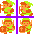

# Sprites
<sub>Extends [Resource]</sub>

Sprites are used to show images for the player.
A Sprite can consist of only one sprite, or it can be a sprite sheet.

## Properties
| Name | Description | Type |
| ------- | --- | --- |
| element | \ element for the sprite, loads if it was unloaded | [Image] |
| path    | A string used for the element's src attribute | [String] |
| size | Size of the sprite | [Vector2] |
| offset | Offset between sprites for a sprite sheet | [Vector2] |
| pivot | The rendering pivot in percentages | [Vector2] |
| labels | The labels for specific sprites on the sheet | [Sprite Labels] |
## Methods
| Name | Description | Returns |
| --- | --- | --- |
| load   | Loads the \ element. Getting element will load it automatically |
| unload | Unloads the element |
| getSpriteRect | Returns the rect for the sprite | [Rect] |
| getSpriteFromLabel | Returns a rect using one of the sprite's label | [Rect]

## Usage Example:

### Constructor:
```javascript
import {sprites} from './Assets';
import Sprite from './engine/Sprite';
/*	
	path : String
			The string used for the  element's src attribute
	size : [x: Number, y: Number]
			Size of the sprite 
	pivot : [x: Number, y: Number]
			Position of the pivot point for rendering given in percentages
			By default it's [0.5,0.5] which is middle
*/
let sprite = new Sprite(path, size);
let pivotSprite = new Sprite(path, size, pivot);
/*	
	path : String
			The string used for the  element's src attribute
	size : [x: Number, y: Number]
			Size of the sprite 
	offset : [x: Number, y: Number]
			Used for the offset values between the sprites on a sprite sheet
	labels : Sprite Label
*/
let spritesheet = new Sprite(path, size, offset, labels);
``` 

Note: `sprites.js` contains a sprites map, for easier usage, it's suggested to add every sprite here. To access them use `import {sprites} from './sprites';`

### load, unload:
```javascript
import Sprite from './engine/sprites';

let sprite = new Sprite("./player.png", [16,16]);
sprite.load()	// loads the image to the memory
sprite.unload()	// unloads the image from the memory
``` 
### getSpriteRect:
```javascript
import Sprite from './engine/sprites';
let sprite = new Sprite("./player.png", [16,16], [2,2], {});
/*
getSpriteRect(x, y):
	x : Number
			Horizontal offset on the spritesheet
	y : Number
			Vertical offset on the spritesheet
*/
let rect = sprite.getSpriteRect(1, 0);
``` 
Having this as the spritemap
 (Note the purple offset between the sprites)
the function would return the top-right sprite.


### getSpriteFromLabel:
```javascript
import Sprite from './engine/sprites';
let sprite = new Sprite("./player.png", [16,16], [2,2], {
						  "LEFT": {x: 0, y: 0},
						  "DOWN": {x: 0, y: 1}
						});
/*
getSpriteFromLabel(label, offsetX, offsetY):
	label : String
			The label key, can be lowercase
	offsetX : Number
			Horizontal offset on the spritesheet
	offsetY : Number
			Vertical offset on the spritesheet
*/
let rect = sprite.getSpriteFromLabel("down", 1, 0);
``` 
Having this as the spritemap
 (Note the purple offset between the sprites)
the function would return the bottom-right sprite. The label `"down"` points to the bottom-left sprite, and offsetX shifts it to the right by one.

<sub>See also [Sprite Labels], [Rect], [Vector2], [Image], [String]</sub>

[Back to Sections]


<!-- Files -->
[Quick Start]: Tutorial
[Inputs]: Input

<!-- Classes -->
[GameObject]: class/GameObject
[Component]: class/Component
[Animator]: class/Animator
[Sprite]: class/Sprite
[Sound]: class/Sound
[Resource]: class/Resource

<!-- Structs -->
[Structs]: structs/Structs
[Vector2]: structs/Vector2
[Rect]: structs/Rect
[Sprite Labels]: structs/SpriteLabel

<!-- Misc -->
[Back to Sections]: Home

<!-- External Links -->
[Boolean]: https://developer.mozilla.org/en-US/docs/Web/JavaScript/Reference/Global_Objects/Boolean
[Number]: https://developer.mozilla.org/en-US/docs/Web/JavaScript/Reference/Global_Objects/Number
[String]: https://developer.mozilla.org/en-US/docs/Web/JavaScript/Reference/Global_Objects/String

[Element]: https://developer.mozilla.org/en-US/docs/Web/API/HTMLElement
[AudioElement]: https://developer.mozilla.org/en-US/docs/Web/API/HTMLAudioElement
[Image]: https://developer.mozilla.org/en-US/docs/Web/API/HTMLImageElement
[Promise]: https://developer.mozilla.org/en-US/docs/Web/JavaScript/Reference/Global_Objects/Promise

[KeyboardEvent.code]: https://developer.mozilla.org/en-US/docs/Web/API/KeyboardEvent/code
[GamepadButton]: https://developer.mozilla.org/en-US/docs/Web/API/Gamepad/axes